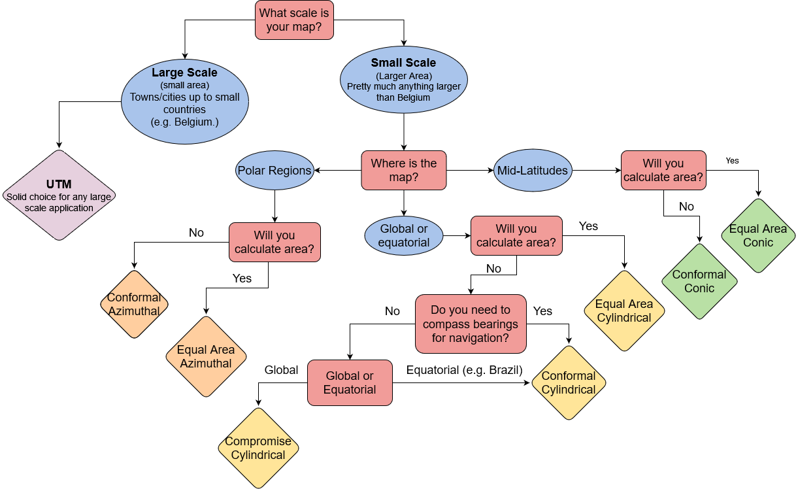

# Additional Resources

## Open Geomatics Textbook

[Chapter 2](https://www.opengeomatics.ca/mapping-data.html) of this open source geomatics textbook gives an overview of how we create map projections, including different types of datums and an in depth explanation of what the geoid is.  It is a bit beyond the scope of this course, and nothing from this book will be on the exam (unless it was covered elsewhere in lecture), but it can serve as a helpful resource for building your conceptual model.

## Choosing a Projection

Here is a simple summary to help you think though which class of map projection you might want to use.  Categories in **bold** are the most common classes we use.

| Projection Category | Properties | Common Uses |
| :------------- | :-------------: | -------------: |
| **Conformal** | Preserves local shapes and angles | Topographic maps, navigation charts, weather maps |
| **Equal Area** | Preserves areas | Dot density maps, thematic maps |
| Equidistant| Preserves distance from one or two specified points to all other points on the map | Maps of airline distances, seismic maps showing distances from an earthquake epicenter |
| True Direction | All directions are true from a single specified point (usually the center) to all other points on the map | Navigation and route planning maps |
| **Compromise** | No point is completely distortion free; distortion is minimized near the center and along the equator | World maps |

### Choosing a Projection: Flowchart

